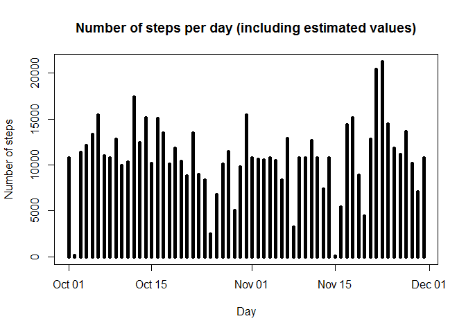

# Reproducible Research: Peer Assessment 1


## Loading and preprocessing the data


```r
# Loading the csv file from the working directory
data <- read.csv(unz("activity.zip","activity.csv"))

# Convert date column to the Date format
data$date <- as.Date(data$date)
```

## What is mean total number of steps taken per day?

```r
# Load the plyr library
library(plyr)

# Sum the number of steps for each date
sum_steps <- ddply(data, "date", function(x){ sum(x$steps, na.rm=TRUE)})

# Plot a histogram showing the number of steps for each day
plot(sum_steps$date, sum_steps$V1, type="h", main="Number of steps per day", xlab="Day", ylab="Number of steps", lwd="5")
```

 

```r
# Calculate the mean number of steps per day
mean(sum_steps$V1, na.rm=TRUE)
```

```
## [1] 9354.23
```

```r
# Calculate the median number of steps per day
median(sum_steps$V1, na.rm=TRUE)
```

```
## [1] 10395
```

## What is the average daily activity pattern?


```r
# Average the number of steps for each five minute period 
mean_steps <- ddply(data, "interval", function(x){ mean(x$steps, na.rm=TRUE)})

# Plot a time series plot showing the number of steps for each day
plot(mean_steps$interval, mean_steps$V1, type="l", main="Average number of steps for each five minute period", xlab="Day", ylab="Average number of steps")
```

 

```r
# Identify the 5 minute block with the highest average number of steps
mean_steps[mean_steps$V1==max(mean_steps$V1),]
```

```
##     interval       V1
## 104      835 206.1698
```

## Imputing missing values


```r
# Count the number of intervals with missing information (NA) 
sum(is.na(data$steps))
```

```
## [1] 2304
```

```r
# Create a new copy of the dataframe
new_data <- data

# Replace steps values NA with the average value for that interval
for (counter in which(is.na(data$steps))){
  interval <- data[counter,]$interval
  new_data[counter,]$steps <- mean_steps$V1[mean_steps$interval == interval]
}

# Sum the steps within the data frame containing estimated values
new_sum_steps <- ddply(new_data, "date", function(x){ sum(x$steps, na.rm=TRUE)})

# Plot the new graph
plot(new_sum_steps$date, new_sum_steps$V1, type="h", main="Number of steps per day (including estimated values)", xlab="Day", ylab="Number of steps", lwd="5")
```

 

```r
# Calculate the mean number of steps per day for the new data
mean(new_sum_steps$V1)
```

```
## [1] 10766.19
```

```r
# Calculate the median number of steps per day for the new data
median(new_sum_steps$V1)
```

```
## [1] 10766.19
```
### Questions

- Do these values differ from the estimates from the first part of the assignment?  
Yes the estimates differ.

- What is the impact of imputing missing data on the estimates of the total daily number of steps?  
The estimates have increased. Note that this relates to how NA values are handled by summation and grouping (i.e. in my code a day that only contains NA values has a summary value of 0)

## Are there differences in activity patterns between weekdays and weekends?


```r
# Add a new factor variable to the data frame indicating if it is a weekday or not 
new_data <- mutate(new_data, weekday_or_weekend = weekdays(new_data$date) %in% c("Saturday", "Sunday"))
new_data[!new_data$weekday_or_weekend, "weekday_or_weekend"] <- "weekday"
new_data[new_data$weekday_or_weekend == "TRUE", "weekday_or_weekend"] <- "weekend"

# Make factor
new_data$weekday_or_weekend <- factor(new_data$weekday_or_weekend)

# Average the number of steps for each five minute period 
new_mean_steps <- ddply(new_data, c("interval","weekday_or_weekend"), function(x){ mean(x$steps, na.rm=TRUE)})

# Build graph using lattice
library(lattice)

xyplot(V1 ~ interval | weekday_or_weekend, layout = c(1,2), data = new_mean_steps, xlab = "Interval", ylab = "Number of steps", type = "l")
```

 
